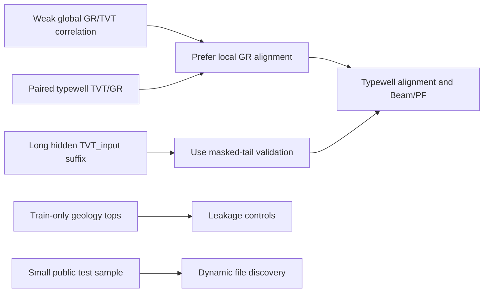

# 2. EDA Insights

## 1. Purpose

This page turns [`1_rogii_eda.ipynb`](../notebooks/1_rogii_eda.ipynb) into a reviewer-friendly EDA summary. The notebook remains the executable record; this file keeps the findings easy to scan.

## 2. Main Findings

The public sample shows a file-per-well sequence problem, not a flat tabular regression problem.

| Finding | Evidence | Modeling Implication |
|---|---:|---|
| Training inventory | `773` horizontal wells and `773` paired typewells | Use grouped/well-level validation. |
| Public sample inventory | `3` horizontal wells | Treat public sample as a smoke test; hidden rerun can be larger. |
| Submission rows | `14,151` requested predictions | Prediction target is row-indexed hidden suffix, not one value per well. |
| Hidden interval length | about `73-74%` of each well | This is long-range trajectory reconstruction, not short interpolation. |
| Sampled `GR` missingness | about `32%` | Missingness handling is core model logic. |
| Global `GR` to `TVT` correlation | weak | Alignment and local shape matching matter more than row-wise regression. |
| Train-only geology tops | `ANCC`, `ASTNU`, `ASTNL`, `EGFDU`, `EGFDL`, `BUDA` | Avoid direct leakage; estimate equivalents only if needed for test. |

## 3. Latest Notebook Readout

The latest EDA run produced these reviewer-facing checks:

| Check | Output | Interpretation |
|---|---:|---|
| Train files | `773` horizontal wells and `773` typewells | Enough wells for grouped validation and neighbor-based geology features. |
| Public test files | `3` horizontal wells and `3` typewells | Public score can move sharply when one well changes. |
| Submission shape | `14,151` rows and `3` public wells | The target is a long row-level suffix. |
| Requested rows per public well | `3,836` to `6,014` | Hidden interval length varies materially by well. |
| Train median rows | `6,576` horizontal rows | Runtime and feature generation should be well-parallelized. |
| Train median hidden suffix | `74.0%` | Long-tail validation is the right local test. |
| Public median hidden suffix | `72.7%` | Public wells follow the same broad hidden-tail pattern. |
| Train median `TVT` range | `758.22` ft | A constant or naive trend can miss large vertical movement. |
| Sampled train rows | `90,000` rows across `60` wells | EDA samples are large enough for stable missingness/correlation checks. |
| Sampled `GR` missingness | `32.0%` | Imputation and missingness indicators should stay in the model. |
| Sampled `MD`/`TVT` correlation | `0.413` | Measured depth gives partial trend signal. |
| Sampled `GR`/`TVT` correlation | `-0.052` | Useful `GR` signal is local shape alignment, not global correlation. |

## 4. Data Structure Insight

Each well contributes two related logs:

- horizontal well: `MD`, `X`, `Y`, `Z`, `GR`, `TVT_input`, and training-only `TVT`;
- typewell: vertical reference `TVT`, `GR`, and geology labels.

The key modeling problem is to map horizontal-well positions after Prediction Start onto a plausible `TVT` trajectory. The paired typewell is useful because it provides a reference `GR` signature on the `TVT` scale, but local horizontal `GR` before Prediction Start can sometimes be more informative than the typewell alone.

## 5. Leakage Insight

The strongest leakage risks are:

- using training-only horizontal `TVT` as a feature;
- using geology-top columns that are missing from test;
- trusting the small public sample as the final test shape;
- hardcoding the three public test wells;
- using public `TVT_input` exposed before Prediction Start as if hidden rows had true target values.

The practical modeling response is to mask training wells in the same pattern as test inference and build features only from visible-prefix data plus typewell inputs.

## 6. Sample Plot: Hidden Interval Distribution

Use this plot to show why carry-forward is only a safety baseline.

```python
fig, ax = plt.subplots(figsize=(8, 4))
sns.histplot(
    data=horizontal_meta,
    x="tvt_input_missing_frac",
    hue="split",
    bins=30,
    element="step",
    palette="viridis",
    ax=ax,
)
ax.set_title("Hidden TVT_input Fraction By Well")
ax.set_xlabel("Fraction of rows hidden after Prediction Start")
ax.set_ylabel("Well count")
plt.tight_layout()
plt.show()
```

Expected readout: most wells have a long hidden suffix. Validation should therefore mask tails, not random rows.

## 7. Sample Chart: EDA Decision Map



## 8. Recommended Charts

These charts are the most useful for explaining the modeling direction:

- file inventory by split and file type;
- per-well hidden `TVT_input` fraction;
- missingness by important column;
- representative horizontal `GR`, `TVT_input`, and typewell `GR` overlays;
- `GR` versus `TVT` scatter on a sampled subset;
- map view of well coordinates, colored by split or available target status;
- typewell `TVT` coverage versus horizontal-well target range.

## 9. Do We Need Deeper Analysis?

Yes, but it should be targeted rather than broad.

Recommended deep dives:

1. **Public-well sensitivity**: compare Beam/PF submission curves by public well to isolate which well drives score changes between versions. Done 2026-07-29 for the one recoverable real pair (V5 vs. V11, see `docs/8_run_log.md`): the longest-hidden-tail public well (`00bbac68`) dominated the difference, the other two barely moved.
2. **Alignment quality by well**: score known-prefix horizontal `GR` against typewell `GR` and identify wells where typewell alignment is weak.
3. **Trajectory monotonicity and reversals**: quantify where true training `TVT` increases, decreases, or stays flat after Prediction Start.
4. **Spatial dip behavior**: estimate local formation dip from neighboring wells and compare it with Beam/PF formation-plane features.
5. **GR missingness patterns**: separate random gaps from long missing blocks, because they need different imputation strategies.
6. **Per-well validation error curves**: inspect whether models fail at the start of the hidden interval, after long extrapolation, or around sharp trajectory turns.

These are worth adding to `1_rogii_eda.ipynb` when they change modeling decisions or explain a Beam/PF failure mode.
